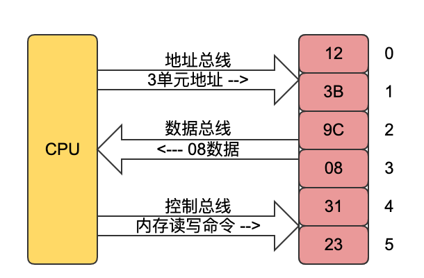

# 汇编语言介绍

- 机器语言
  - 机器语言是机器指令集合，机器指令是一台计算机可以正确执行的指令。CPU是中央处理器，是一种微处理器，由于硬件和内部设计不同，每个微处理器有自己的机器指令集合。

- 汇编语言背景
  - 汇编语言的主体是汇编指令，汇编指令和机器指令差别在于指令的标识方法上，汇编指令是机器指令便于记忆的书写格式。比如把机器指令1000100111011000标识把BX内容送到AX中，汇指令则携程mov ax,bx.
  - 寄存器是CPU可以存储数据的硬件，一个CPU中有多个寄存器，AX和BX都是寄存器的代号。
  - 汇编语言源程序需要经过汇编将源代码翻译为机器码，最终由计算机执行
  - 汇编语言有如下三部分组成:汇编指令、伪指令、其他符号。
  
- CPU总线
  - CPU要从内存中读取数据，首先要指定存储单元地址(内存地址)，来说明CPU要读取哪一个存储单元中的数据；同时CPU数据操作时候，还需要指明CPU要对哪一个器件(寄存器)、进行哪一种操作，是读还是写。
  - CPU进行数据读写，必须和外部器件进行信息交互：
    - 地址信息:存储单元的地址，地址信息
    - 控制信息:器件选择、读或者写的命令
    - 数据信息:读或者写的数据
    - 连接CPU和其他芯片的导线叫做总线，总线从物理上上分为三类分别是地址总线、控制总线、数据总线
      - 地址总线，CPU通过地址总线来指定存储器单元的，一个CPU有10根地址总线，则CPU的地址总线宽度为10，能寻址的内存地址空位为2的10次方单元
      - 数据总线，CPU和内存或者其他的器件之间数据传送是通过数据总线来进行，数据总线宽度决定CPU和外界数据传送的速度，8根数据总线依次一次可以传输8个二进制位，即一个字节
      - 控制总线，CPU对外部器件控制是通过控制总线来进行，控制总线是一些不同控制线的集合，有多少根控制总线就意味着CPU提供了多少对外部器件的多少种控制。
  

- CPU操作数据过程
    
    - 读过程：
      - CPU通过地址总线将地址3信息发出
      - CPU通过控制总线发去内存读取命令，选中存储芯片，并通知它，将要从3单元地址读取数据
      - 存储器(内存)将3号单元的数据8通过数据总线送入CPU
    - 写过程:
      - CPU通过地址总线将地址信息3单元发出
      - CPU通过控制总线发出内存写命令，选中存储芯片，并通知存储芯片要写入数据
      - CPU通过数据总线将数据写入到3单元地址中
  