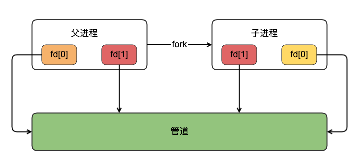
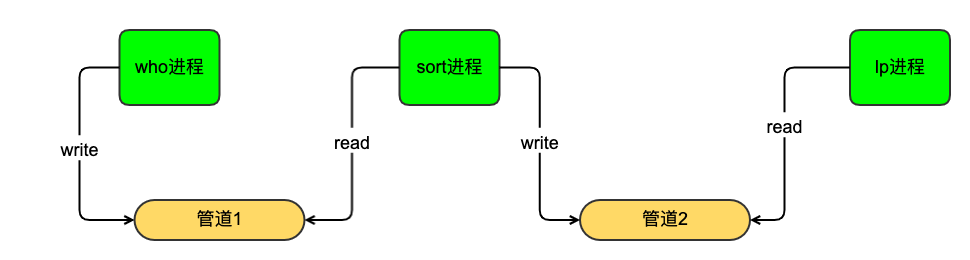
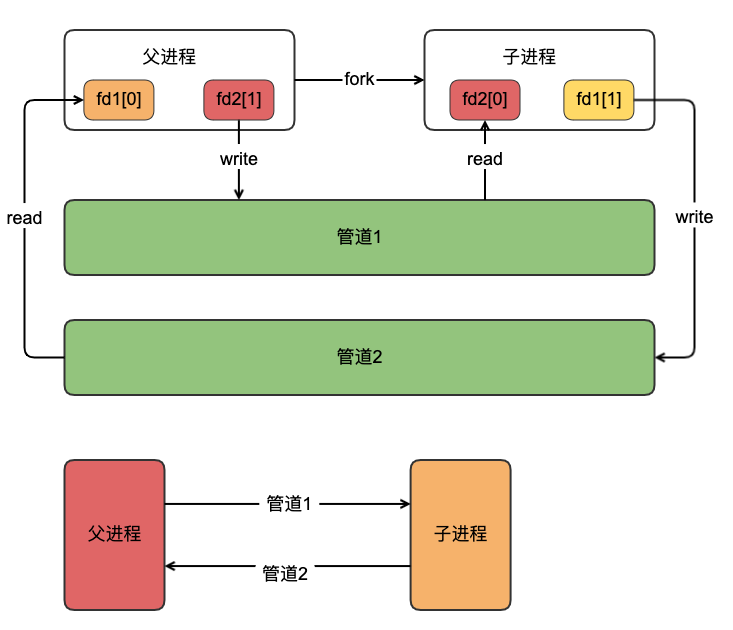

## 管道的基本原理和使用
### 基本介绍

- IPC是进程间通信的简称，运行在某个操作系统之上不同进程之间各种消息传递的方式
- 进程/线程和信息共享：Unix进程间共享信息有三种方式，第一种，两个进程共享存储在文件系统中某个文件上的信息，第二种是，两个进程共享驻留在内核的某些信息，比如管道、System V消息队列和System V信号量；第三种方式，两个进程双方都有一个彼此能够访问的共享内存区。


### 管道和FIFO
- 管道可以可以用于无亲缘关系的进程间，但是在实际场景中，管道用于具有共同祖先的进程之间
- 管道创建都是由pipe(int fd[2])系统调用创建，提供单一路的数据流操作，该函数参数为一个数组，2个文件描述符。fd[0]用来读，fd[1]用于写。
- 管道典型用途是为两个不同进程(父子进程)提供进程间通信方式，父进程创建一个管道，然后调用fork创建一个子进程，父进程关闭读管道，子进程关闭写管道
 
- linux执行`who|sort|lp`命令就是采用多进程和管道方式，who命令，sort命令、lp命令都是采用进程去执行。前一个进程执行结果通过管道传递给后面一个进程作为输入处理.
   

- 全双工管道:只提供一个方向的数据流是双工的,单项；如果需要一个双向数据流时，需要创建两个管道，每个方向一个管道，实际的步骤如下
  - 调用pipe创建管道1和管道2
  - 调用fork函数创建子进程
  - 父进程关闭管道1的读和管道2的写
  - 子进程关闭管道1的写和管道1的读
     

  
- 半双工管道代码示例

```
 /*************************************************************************
  > File Name: pipe_test.c
  > Author:perrynzhou 
  > Mail:perrynzhou@gmail.com 
  > Created Time: 一  8/31 07:30:26 2020
************************************************************************/

#include <stdio.h>
#include <unistd.h>
#include <sys/types.h>
#include <sys/uio.h>
#include <unistd.h>
#include <sys/wait.h>
#include <stdlib.h>
int main(void)
{
  int fds[2];
  pipe(fds);
  pid_t pid = fork();
  if (pid > 0)
  {
    close(fds[0]);
    struct timeval tv;
    tv.tv_sec = 5;
    tv.tv_usec = 0;
    int err;
    int i = 0;
    select(0, NULL, NULL, NULL, &tv);
    i++;
    write(fds[1], &i, sizeof(int));
    fprintf(stdout, "[parent pid =%d]write value:%d\n", getpid(), i);
    wait(NULL);
    close(fds[1]);
  }
  else if (pid < 0)
  {
    exit(-1);
  }
  else
  {
    close(fds[1]);
    int v;
    read(fds[0], &v, sizeof(int));
    fprintf(stderr, "[child pid=%ld] read value:%d\n", getpid(), v);
    close(fds[0]);
  }
  return 0;
}
```	
