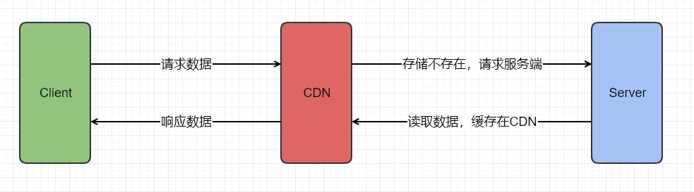

## 缓存基本介绍

- 缓存的例子
	
	- CPU缓存，在CPU与内存之间的临时存储器，容量比内存小很多但是交换速度却比内存快很多，一般CPU会有L1/L2/L3的缓存。CPU运算速度要比内存读写速度快很多，CPU总有等待数据数据时候，而CPU高速缓存解决CPU运算速度和内存读写速度不匹配的问题。
	- 虚拟内存管理，应用程序使用的是虚拟地址，当应用程序实际使用内存空间时候，需要虚拟地址转换为物理地址，这个地址转换是采用MMU的硬件(内存管理单元)，MMU也会采用TLB缓存这些虚拟地址到物理地址的信息，提高访问效率
- 缓存类型
	- 一般分为客户端缓存、服务器缓存、网络中缓存
- 为什么要使用缓存？
	- 为了提供用户体验，影响用户体验的因素有使用者状态、系统性能、环境。系统性能是软件产品自身对用户体验的关键因素
	- 在海量并发情况下，减低事务性数据库的压力，使用缓存作为数据库前面的缓存，数据如果在缓存，优先请求缓存降低用户影响时间；数据不再缓存，则需要请求数据库。
	- web代理缓存，一般代理方式有正向代理、反向代理。web代理典型的产品就是lighttpd和nginx、squid、varnish等产品。比较成功的商业化的方案就是CDN。
      
	- 数据库缓存，一般传统数据库都会有数据缓存的功能，其目的是为了减少访问磁盘的次数，提供数据库的吞吐量和性能，典型的代表有Postgresql、Mysql、Oracle等。
	- 应用级缓存，需要开发这通过代码来实现缓存的机制，典型代表有Redis、Memcached、MongoDB等。
- 缓存常用术语
	- 缓存命中，客户请求的数据在缓存中，这一行为叫缓存命中
	- 没有命中，cache miss是没有命中，请求数据不在缓存中
	- 缓存失效，当缓存中的数据需要更新时候，这就意味着缓存中的数据失效
	- 淘汰策略，当缓存中的可用空间不足时候，按照一定的算法策略把缓存中的数据淘汰或者flush到磁盘

- 缓存的淘汰策略
	- LRU，替换掉最近请求最少的对象，这种策略也是使用最广泛的
	- LFU，替换掉访问次数最少的对象
	- LRU2,把访问过2次放到缓存中，当缓存满了，会把2次中最少使用的对象淘汰掉
	- SIZE，按照对象大小进行淘汰
	- Hyper-G,LFU改进版本，同时需要考虑访问时间和对象大小
	- Random,随机淘汰缓存对象
- 典型的架构
	
	- 1.用户请求到达nginx，nginx配置的反向代理的服务，依据轮询或者IP加权方式，转发请求到后端服务
	- 2.如果用户请求的nginx的静态资源，直接从nginx中返回
	- 3.nginx转发到后端的服务，服务优先查询redis
	- 4.如果redis数据不命中，则需要请求mysql,请求完毕后数据会写到redis中
	- 3.一切处理完毕，数据在有nginx返回到用户端